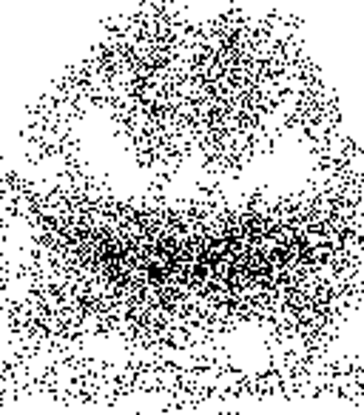

# OliCyber.IT 2022 - Competizione nazionale

## [misc-1] GGOL (6 risoluzioni)

```
`Conway's Game of Life`? No grazie preferisco `Gabibbo's Game Of Life`!
```

La challenge è una implementazione semplificata di [Critters](<https://en.wikipedia.org/wiki/Critters_(cellular_automaton)>): un cellular automata invertibile. Le regole sono basate su blocchi 2 x 2.

### Soluzione

Guardando al codice sorgente si capisce che le regole da invertire sono queste (nella funzione step):

```py
if s == 2:
	# two alive cells: do nothing
	pass
elif s == 3:
	# three alive cells: rotate clockwise and flip
	c00, c01, c11, c10 = c10, c00, c01, c11
	c00, c01, c11, c10 = c00 ^ 1, c01 ^ 1, c11 ^ 1, c10 ^ 1
else:
	# zero, one of four alive cells: flip
	c00, c01, c11, c10 = c00 ^ 1, c01 ^ 1, c11 ^ 1, c10 ^ 1
```

E per invertirle basta cambiare quella nel secondo blocco if:

```py
if s == 2:
	# two alive cells: do nothing
	pass
elif s == 1:
	# one alive cell: rotate counterclockwise and flip
	c00, c01, c11, c10 = c01, c11, c10, c00
	c00, c01, c11, c10 = c00 ^ 1, c01 ^ 1, c11 ^ 1, c10 ^ 1
else:
	# zero, three of four alive cells: flip
	c00, c01, c11, c10 = c00 ^ 1, c01 ^ 1, c11 ^ 1, c10 ^ 1
```

Questo è il risultato renderizzando ogni step della soluzine:



### Exploit

```py
from PIL import Image


class Critters:
    """Simplified implementation of https://en.wikipedia.org/wiki/Critters_(cellular_automaton)"""

    def __init__(self, grid):
        self.grid = grid
        self.h = len(grid)
        self.w = len(grid[0])
        self.roundno = 0

        if self.h % 2 != 0 or self.w % 2 != 0:
            raise ValueError("The grid dimensions must be a multiple of two")
        if any(c not in (0, 1) for row in grid for c in row):
            raise ValueError("The grid must contain either 0 or 1")

    def step(self):
		pass

    def step_backwards(self):
        self.roundno -= 1
        off = self.roundno % 2

        for j in range(0, self.h - 1, 2):
            for i in range(0, self.w - 1, 2):
                # get value of cells in 2x2 block
                c00 = self.grid[(off + j) % self.h][(off + i) % self.w]
                c01 = self.grid[(off + j) % self.h][(off + i + 1) % self.w]
                c11 = self.grid[(off + j + 1) % self.h][(off + i + 1) % self.w]
                c10 = self.grid[(off + j + 1) % self.h][(off + i) % self.w]

                # number of alive cells in 2x2 block
                s = c00 + c10 + c01 + c11

                if s == 2:
                    # two alive cells: do nothing
                    pass
                elif s == 1:
                    # one alive cell: rotate counterclockwise and flip
                    c00, c01, c11, c10 = c01, c11, c10, c00
                    c00, c01, c11, c10 = c00 ^ 1, c01 ^ 1, c11 ^ 1, c10 ^ 1
                else:
                    # zero, three of four alive cells: flip
                    c00, c01, c11, c10 = c00 ^ 1, c01 ^ 1, c11 ^ 1, c10 ^ 1

                # update the grid in place
                self.grid[(off + j) % self.h][(off + i) % self.w] = c00
                self.grid[(off + j) % self.h][(off + i + 1) % self.w] = c01
                self.grid[(off + j + 1) % self.h][(off + i + 1) % self.w] = c11
                self.grid[(off + j + 1) % self.h][(off + i) % self.w] = c10


img_in = Image.open("attachments/out.png").convert("L")

# convert black to 1 and white to 0
grid = [
    [1 if img_in.getpixel((i, j)) == 0 else 0 for i in range(img_in.width)]
    for j in range(img_in.height)
]

critters = Critters(grid)
for _ in range(42):
    critters.step_backwards()

# save the image
img_out = Image.new(mode="L", size=img_in.size)
img_out_px = img_out.load()
for i in range(img_in.width):
	for j in range(img_in.height):
		x = critters.grid[j][i]
		img_out_px[i, j] = 255 if x == 0 else 0

img_out.save(f"flag.png")
```
